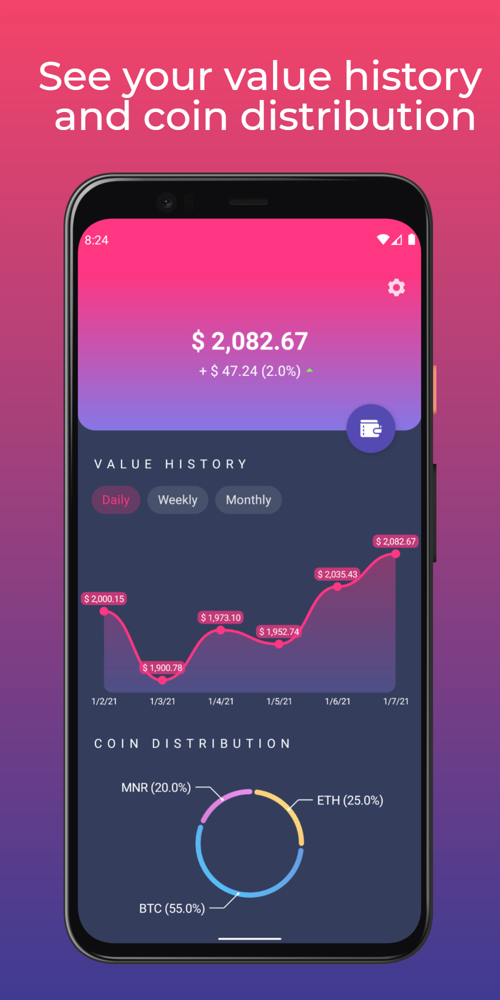
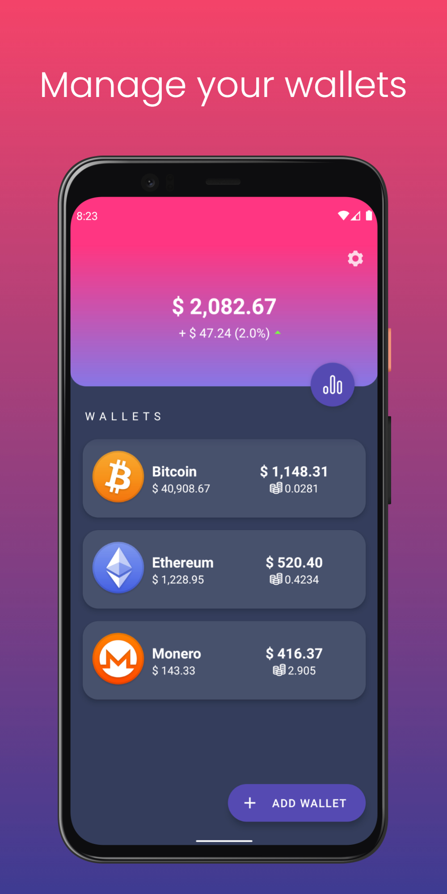
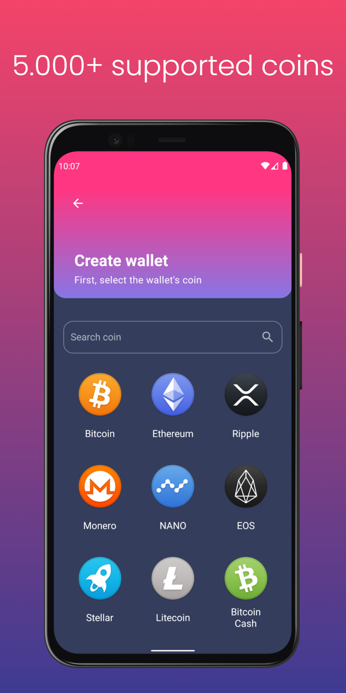

# Mentra 

Android app to track the value of your cryptocurrency portfolio over time.


Features
-------------------------------------------------
- Automatically and periodically refresh the value of your portfolio on the background
- See the daily, weekly and monthly value history of your portfolio
- See the coin distribution of your portfolio
- Select your preferred currency to see prices and values
- Manage your wallets

<div style="display:flex">
  
  
  
</div>
Preview images were created with <a href="https://previewed.app/">Previewed</a>


### Dependencies
- **Kotlin Coroutines** to handle asynchronous work and reactive streams.
- **Retrofit** for HTTP requests.
- **Glide** for image loading and caching.
- **Dagger Hilt** for dependency injection.
- **MPAndroidChart** to display the different line charts.
- **CryptoCompare** API to fetch the list of coins and their prices.
- **Firebase Crashlytics** for crash reports.

### Version control workflow
This project loosely follows the `Git Flow` approach.

`master` is the release branch, it should be releasable and code should be merged only after ensuring that everything works.

Daily development is done in the `development` branch. Features, non-critical bugfixes and other tasks are done as branches off of develop, then squashed and merged back into `develop`.

Critical bug fixes should be done in `hotfix` branches off of `master`, then squashed and merged back into `master`, updating `develop` afterwards.

The squashed commit messages must follow the [Angular commit guidelines](https://github.com/angular/angular/blob/22b96b9/CONTRIBUTING.md#-commit-message-guidelines).

### Releasing a new version
- In `develop`, update the major/minor/patch version and increment the version code by one. Commit.
- Merge `develop` into `master`.
- Tag it: ```git tag -a v1.3.21 -m "Fixed a tricky bug"```
- Build the release APK.
- Publish to Google Play doing a staged rollout to 15% of users.
- Two days later, roll out to all users if crash reports are stable.


